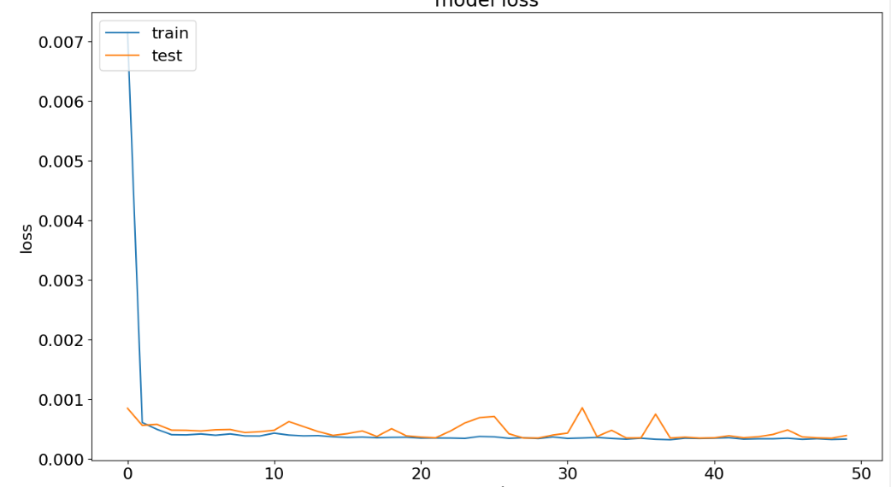

# 환율 예측

- 0910 과적합 문제

    
    
    
    모델 성능 평가
    
    RMSE: 7.431500656517858
    MAE: 6.297843143857759
    R²: 0.8371447500627374  

- 0910 과적합 문제 해결1 - L2 정규화
    
    
    
    
    모델 성능 평가
    
    RMSE: 12.268521561241998
    MAE: 10.300605861619971
    R²: 0.5561531077052881
    
    한줄평: 더 안좋아졌다
    
    
- 0910 과적합 문제 해결2 - LR 감소 및 batch size 증가(32 → 64)
    
    
    
    
    
    과적합도 덜되고 속도도 좀 빨리지긴함. 근데 전체 성능이 좀
    
    RMSE: 8.247486005059297
    MAE: 6.327037592043822
    R²: 0.7994180278854156
    

- 0910 과적합 문제 해결3 - 에폭 증가(50 → 80)
    
    
    
    
    
    RMSE: 8.946004365497322
    MAE: 6.916496890714799
    R²: 0.764002754543725
    

- 0910 과적합 문제 해결4 - LR 증가
    
    lr = 0.005
    
    에폭 = 80
    
    batch size 64
    
    l2 정규화 없음
    
    
    
    
    RMSE: 10.65181071701039
    MAE: 9.136271158854166
    R²: 0.6654233693937203
    
    쓰읍… 별로다
    

- 0910 과적합 문제 해결5 - LR 증가, bs 감소가 아니라 l2 정규화가 있었네 이거 제거
    
    lr = 0.005
    
    에폭 = 80
    
    batch size 32
    
    **l2 정규화 제거**
    
    
    
    
    RMSE: 7.3518777349130815
    MAE: 6.217487203663793
    R²: 0.8406157973052811
    
    **현재 모델에서 L2 정규화는 안넣는게 맞는듯**

    
- 0910 과적합 문제 해결6 - 조기 종료 추가
    
    
    
    
    
    RMSE: 6.94715202709584
    MAE: 5.542717593839799
    R²: 0.8576811820400049
    
    **성능 평가 결과가 높고 빨리 학습이 된다.**
    
    근데 약간 한끗이 아쉬운데
    

- 0911 과적합 문제 해결7 - LR 증가
    
    lr = 0.01
    
    
    
    
    RMSE: 6.499005542181231
    MAE: 5.086873372395833
    R²: 0.8754503426566197
    
    전체적인 성능은 개선되었으니 과적합 해결은 X  
    
    
- 0911 과적합 문제 해결8 - Batch Size 감소
    
    batch_size=4
    
    성능 개선도 안되고 너무 느림
    
    
    
    
    RMSE: 7.020816896390506
    MAE: 5.400105794270833
    R²: 0.8546469946077682